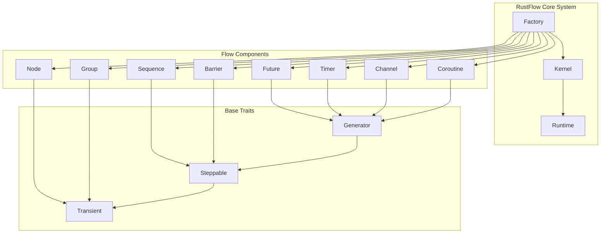
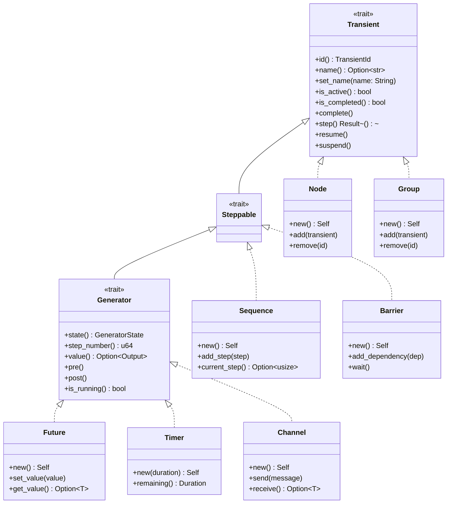
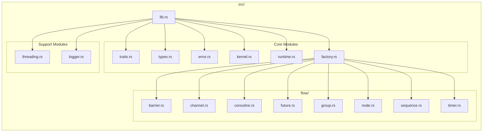
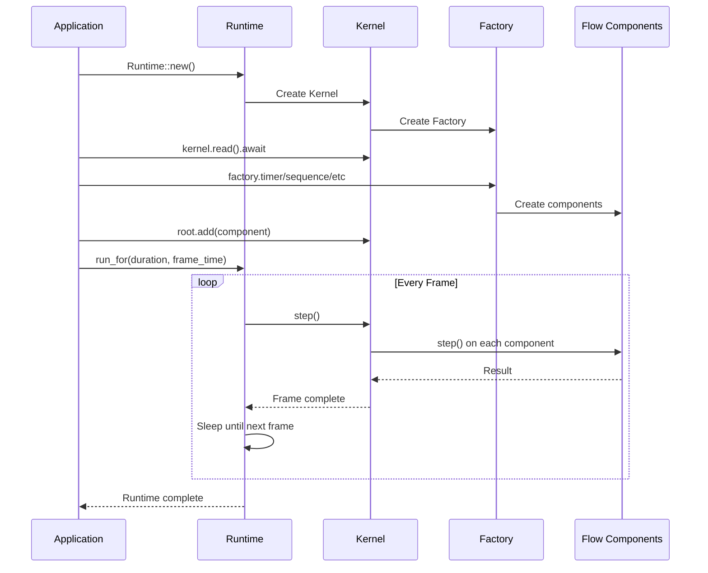
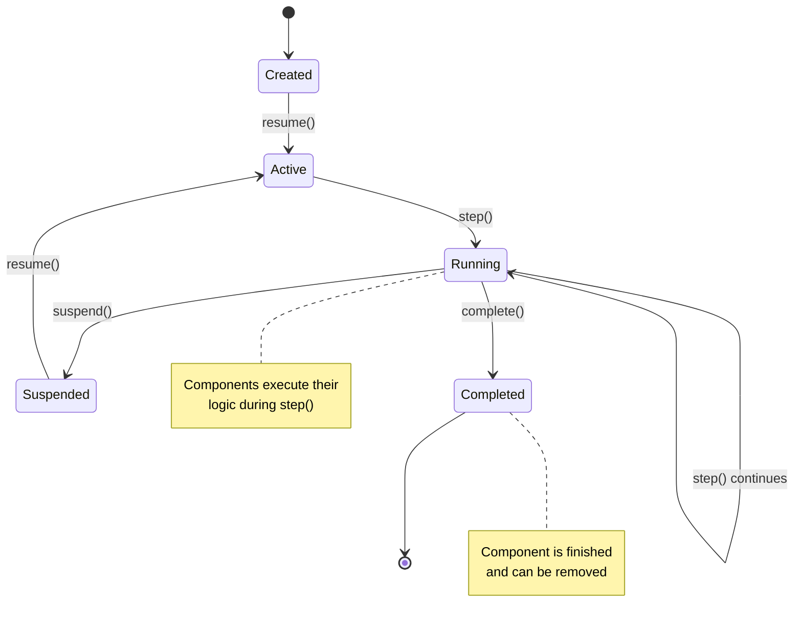
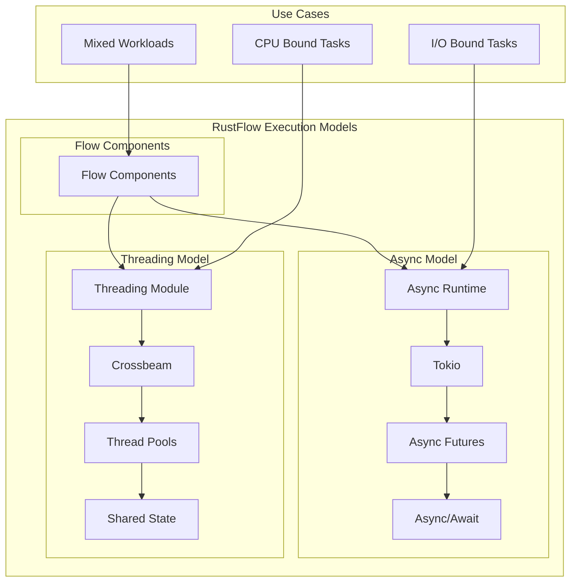
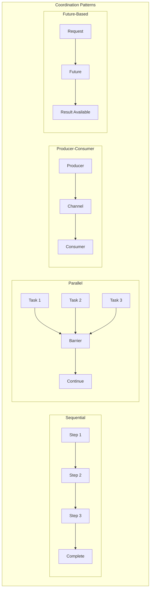

# RustFlow Architecture Diagrams

## Project Architecture Overview

## Class Hierarchy and Trait Relationships

## Module Structure

## Runtime Execution Flow

## Flow Component Lifecycle

## Threading vs Async Architecture

## Component Interaction Patterns

