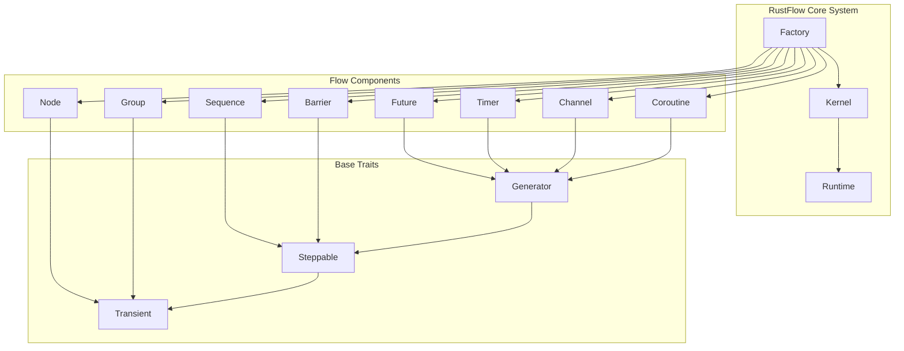
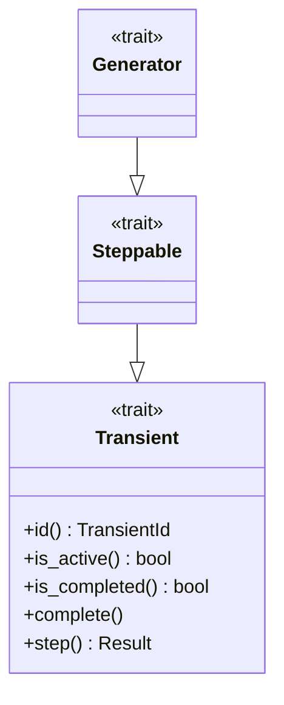

# RustFlow Architecture

## Core system

```mermaid
graph TB
    subgraph "RustFlow Core System"
        K[Kernel]
        R[Runtime]
        F[Factory]
        F --> K
        K --> R
    end
    subgraph "Flow Components"
        N[Node]
        G[Group]
        S[Sequence]
        B[Barrier]
        FU[Future]
        T[Timer]
        CH[Channel]
        CO[Coroutine]
    end
    subgraph "Base Traits"
        TR[Transient]
        ST[Steppable]
        GE[Generator]
    end
    F --> N
    F --> G
    F --> S
    F --> B
    F --> FU
    F --> T
    F --> CH
    F --> CO
    N --> TR
    G --> TR
    S --> ST
    B --> ST
    FU --> GE
    T --> GE
    CH --> GE
    CO --> GE
    ST --> TR
    GE --> ST
```

## Trait hierarchy

```mermaid
classDiagram
    class Transient {
        <<trait>>
        +id() TransientId
        +is_active() bool
        +is_completed() bool
        +complete()
        +step() Result
    }
    class Steppable {
        <<trait>>
    }
    class Generator {
        <<trait>>
    }
    Steppable --|> Transient
    Generator --|> Steppable
```
